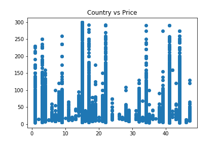
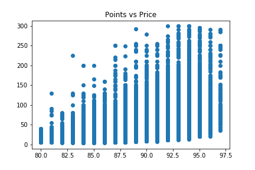
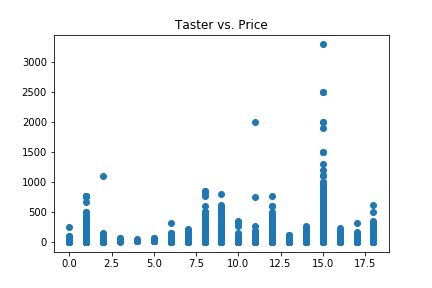
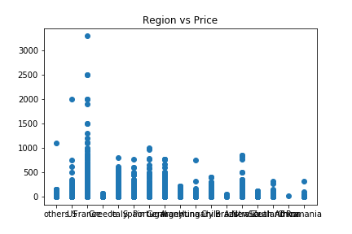
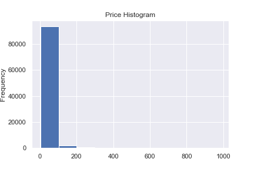
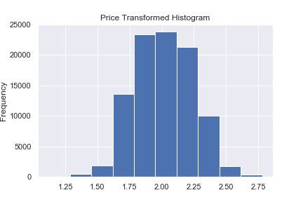
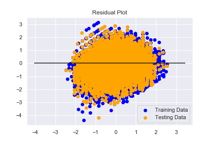

# Wine Pricing Application

Dataset: https://www.kaggle.com/zynicide/wine-reviews
  - Data includes hundreds of thousands of different wines made all over the world that were rated by sommoliers - the data consists of all wines rated 80-100
  
## Objective:
  - Analysize the various different types of wines, where they were made, the winery, the taster, etc. and see if we can find trends with location, taster, type of wine, the rated points by the sommolier, and price
  
Inspiration:
  - With all of these attributes, are we able to confiedently predict a cost of wine based on these various attributes?

Files:
  - data_exploration.ipynb
      - Exploring and analyzing data. Getting to know it intimiately before building Model.
  - wine_ML_model.ipynb 
      - Jupyter Notebook shows machine learning model used with analysis

## Machine Learning: 
 Data Pre-processing
  - All data organization, table creation, and basic plots to understand any correlations with data
  
  
  
  
  - Many of the attributes that seem to have a correlation with price, are string values. Since they are non-numerical, we need to encode those string values into an array of numerical values. In order to do this, we can either use OneHotEncoding or Pandas get_dummies
  - Plot histogram of price column. We see that the data is psoitively skewed. Using a Box-cox log transformaion should get our data to be more normally distributed to create the model.
  - Pursue model creation once price is normally distributed
  
  
  
  
  
